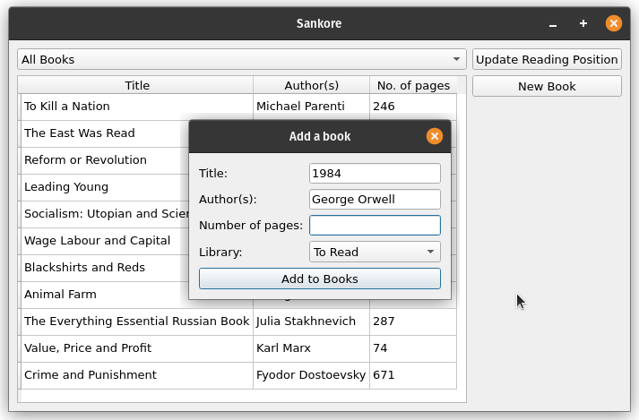
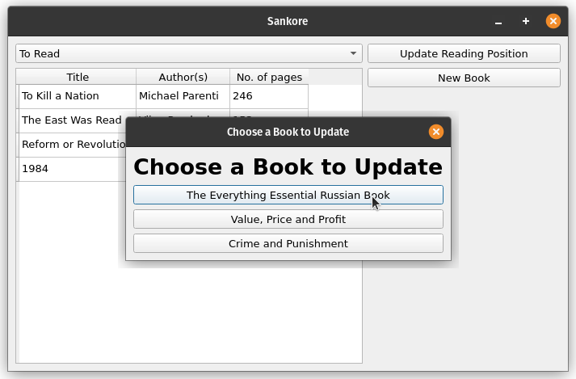
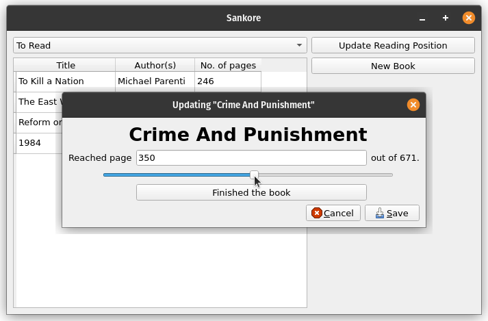

# Sankore

> What if I had a private GoodReads?

Sankore is a small personal project that I built to keep track of my reading habits. It keeps track of the books I have and which ones I'm reading now. Since it works offline, I prefer it to GoodReads. All the data is stored in a JSON file so syncing it is easily accessible anywhere and makes syncing a breeze.

## Installation

First, ensure that you have `python3` on your system and that the version `3.9.0` or above. If it isn't, you can download/update it either from `apt-get` or from <https://python.org/downloads/>. Now that that's out of the way, we can get the app and its' dependencies. You can do this by running:

```bash
$ git clone https://github.com/Armani-T/Sankore
$ cd Sankore
$ pip install -r requirements.txt
```

## Usage

```bash
$ git clone https://github.com/Armani-T/Sankore
$ cd Sankore
$ python3 -m venv .venv
$ source .venv/bin/activate
$ pip install -r requirements.txt  # see note below.
```

If you are downloading to work on the code, then replace `requirements.txt` with `requirements-dev.txt` to get all the essential development packages.

To get the app running, navigate to the `Sankore/` folder and run `python3 sankore`. On start up, the app will look like the first picture below.

## Screenshots








## Contributing Guide

Please use GitHub issues for any bug reports or feature requests.

1. Create your branch by forking `origin/main`.
2. Fix the bug/Create the feature.
3. Push your changes.
4. Open a pull request.

## Meta

- Name: **Armani Tallam**
- E-Mail: armanitallam@gmail.com
- GitHub: <https://www.github.com/Armani-T>

This project is licensed under the **MIT License**. Please see the [license file](LICENSE) for more information.