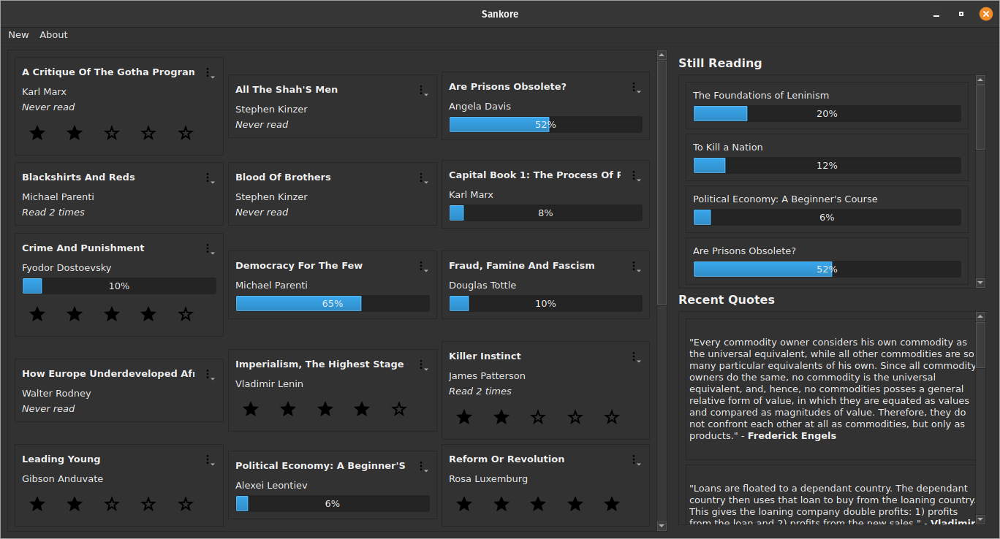
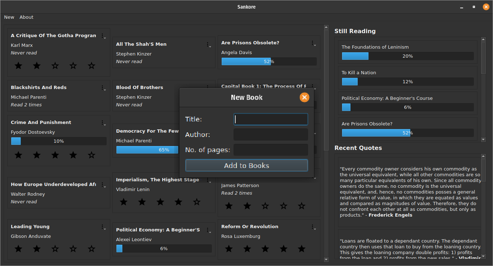

# Sankore

> What if I had a personal GoodReads?

Sankore is a reading habit tracker. It records the books that you've read, the ones you're reading right now and which ones you want to read. It is completely offline and all your data is stored locally so you don't need to worry about an Internet connection.

I built it as a replacement to GoodReads since that requires a network connection to run and all my data is stuck on their servers. In contrast, Sankore uses a simple JSON file to record all your data. This makes it very easy to transfer between machines and back up to wherever you want.

## Features

- [X] User-defined libraries
- [ ] A rating system for finished books
- [ ] A tagging system
- [ ] A quotation store
- [ ] Multiple reads through the book
- [ ] Reading goals and challenges
- [ ] Priority sorting for unread books

## Installation

First, ensure that you have `python3` on your system and that the version `3.9.0` or above. If it isn't, you can download/update it either from `apt-get` or from <https://python.org/downloads/>. Now that that's out of the way, we can get the app and its' dependencies. You can do this by running:

```bash
$ git clone https://github.com/Armani-T/Sankore
$ cd Sankore
$ pip install -r requirements.txt
```

## Usage

```bash
$ git clone https://github.com/Armani-T/Sankore
$ cd Sankore
$ python3 -m venv .venv
$ source .venv/bin/activate
$ pip install -r requirements.txt  # see note below.
```

**NOTE:** If you want to work on the code, replace `requirements.txt` with `requirements-dev.txt` to get all the development dependencies I use.

To get the app running, navigate to the `Sankore/` folder and run `python3 sankore`. On start up, the app will look like the first picture below.

## Screenshots






## Contributing

Please use GitHub issues to make any bug reports or feature requests.

1. Create your branch by forking `origin/main`.
2. Fix the bug/Create the feature.
3. Push your changes.
4. Open a pull request.

`black` is the code formatter used throughout the codebase, you should run it on your code before pushing it.

Commit messages and pull requests must have a title. A description can be included if the title alone isn't self-explanatory or isn't clear enough. The title should be in the active voice like a command.

## Meta

- Name: **Armani Tallam**
- E-Mail: armanitallam@gmail.com
- GitHub: <https://www.github.com/Armani-T>

This project is licensed under the **MIT License**. Please see the [license file](LICENSE) for more information.
